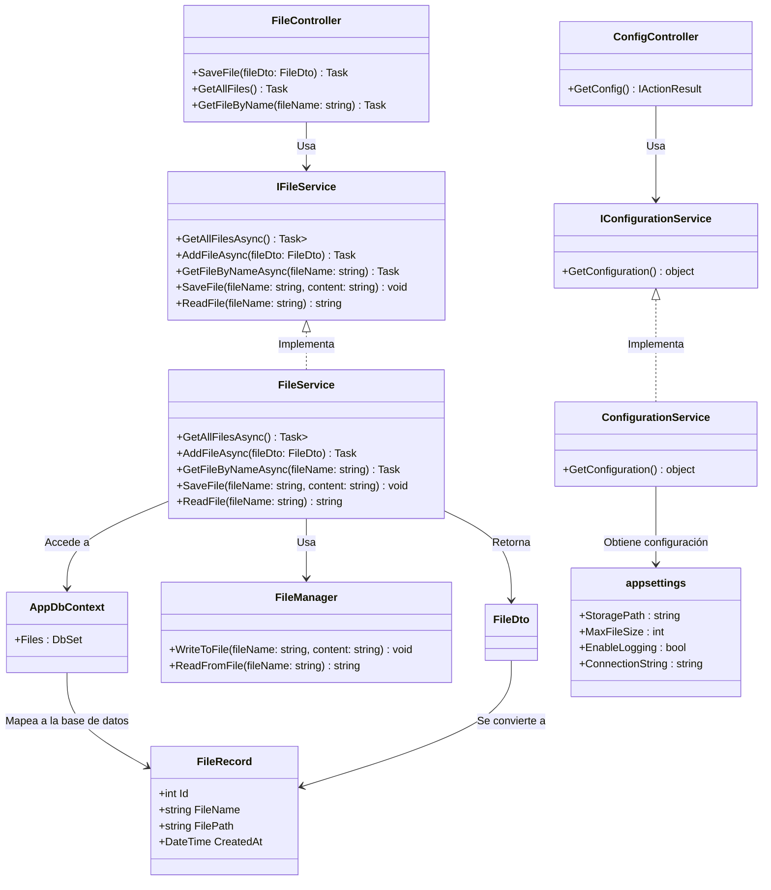

# 📂 Sistema de Procesamiento de Archivos - Clean Architecture

## 📌 **Descripción del Proyecto**
Este proyecto es una API REST desarrollada en **.NET 9** que permite **guardar, leer y gestionar archivos** aplicando los principios de:
- **Clean Architecture** 📂 (Organización modular del código). Más detalles en la [**investigación**](https://github.com/Danielammmm/Clean-Architecture/blob/92c36b2c59002bdfa8eb078e73f9a0b83b6de825/Investigaciones%20y%20aplicaciones/CA.docx).
- **Test-Driven Development (TDD)** ✅ (Desarrollo basado en pruebas). Consulta la [**investigación**](https://github.com/Danielammmm/Clean-Architecture/blob/92c36b2c59002bdfa8eb078e73f9a0b83b6de825/Investigaciones%20y%20aplicaciones/TDD.docx).
- **Dependency Injection (DI)** 🔄 (Inyección de dependencias en los servicios). Más información en la [**investigación**](https://github.com/Danielammmm/Clean-Architecture/blob/92c36b2c59002bdfa8eb078e73f9a0b83b6de825/Investigaciones%20y%20aplicaciones/DI.docx).
- **Single Responsibility Principle (SRP)** 🛠 (Cada clase tiene una sola responsabilidad). Detalles en la [**investigación**](https://github.com/Danielammmm/Clean-Architecture/blob/92c36b2c59002bdfa8eb078e73f9a0b83b6de825/Investigaciones%20y%20aplicaciones/SRP.docx).

El sistema está diseñado para ser **escalable, desacoplado y fácil de mantener**.

---

## 📂 **Estructura del Proyecto**
```bash
📂 FP.CleanArchitecture
├── 📂 FP.API                # API principal (Presentación)
│   ├── Program.cs           # Configuración de servicios y middleware
│   ├── Controllers/         # Controladores de la API
│   │   ├── FileController.cs  # Manejo de archivos
│   │   ├── ConfigController.cs  # Configuración de la aplicación
│   ├── appsettings.json     # Configuración de la BD y parámetros del sistema
│
├── 📂 FP.Application        # Lógica de negocio y contratos
│   ├── Interfaces/          # Definición de servicios
│   │   ├── IFileService.cs  # Interfaz del servicio de archivos
│   ├── DTOs/                # Data Transfer Objects (DTOs)
│   │   ├── FileDto.cs       # DTO para la transferencia de archivos
│
├── 📂 FP.Domain             # Entidades y reglas de negocio
│   ├── Entities/            # Modelos de base de datos
│   │   ├── FileRecord.cs    # Modelo de la tabla "Files"
│
├── 📂 FP.Infrastructure     # Implementación de servicios y persistencia
│   ├── Persistence/         # Configuración de la BD y EF Core
│   │   ├── AppDbContext.cs  # Contexto de base de datos
│   │   ├── Migrations/      # Migraciones de Entity Framework
│   ├── Services/            # Implementación de servicios
│   │   ├── FileService.cs   # Lógica de negocio para archivos
│   │   ├── ConfigurationService.cs  # Servicio de configuración
│   ├── Utils/               # Utilidades adicionales
│   │   ├── FileManager.cs   # Manejo de archivos físicos
│
└── 📂 FP.Tests              # Pruebas unitarias con MSTest
    ├── Services/
    │   ├── FileServiceTests.cs  # Pruebas del servicio de archivos
```

---

## 🚀 **Cómo Ejecutar el Proyecto**
### 1️⃣ Clonar el Repositorio
```sh
git clone <repo-url>
cd FP.CleanArchitecture
```

### 2️⃣ Configurar la Base de Datos
#### Opción 1: Usar Migraciones de EF Core
```sh
dotnet ef database update --project FP.Infrastructure
```
#### Opción 2: Restaurar Base de Datos desde SQL
```sh
sqlcmd -S DESKTOP-LIO9C0K -d master -i FP.Infrastructure/backup.sql
```

### 3️⃣ Ejecutar la API
```sh
dotnet run --project FP.API
```

### 4️⃣ Probar en Swagger
📌 Abrir en el navegador:
🔗 https://localhost:53167/swagger

---

## 📌 **Endpoints de la API**
### 🔹 **Configuración**
| Método | Endpoint      | Descripción                        |
|--------|-------------|----------------------------------|
| GET    | /api/config | Obtiene la configuración del sistema |

### 🔹 **Gestión de Archivos**
| Método | Endpoint         | Descripción                     |
|--------|----------------|---------------------------------|
| POST   | /api/files/save | Guarda un nuevo archivo        |
| GET    | /api/files/all  | Obtiene todos los archivos     |
| GET    | /api/files/search | Busca un archivo por nombre   |

---

## 🏆 **Pruebas Unitarias**
📌 Ejecutar pruebas unitarias con **MSTest**
```sh
dotnet test
```
📌 **Cobertura de Pruebas:**
- **FileServiceTests.cs** → Verifica la funcionalidad del servicio de archivos.
- **ConfigurationServiceTests.cs** → Prueba la carga de configuración desde appsettings.json.

---
## 📂 Diagrama UML - Sistema de Procesamiento de Archivos

Este diagrama muestra la arquitectura del sistema, incluyendo los controladores, servicios, capa de infraestructura y base de datos.


---
